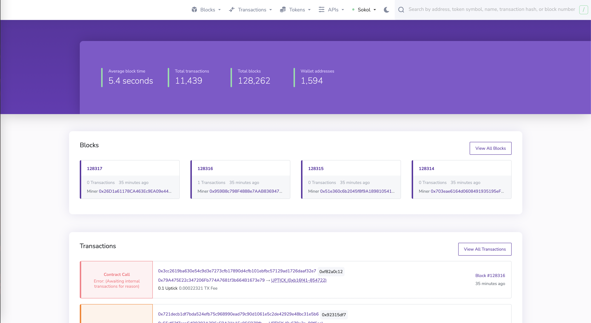
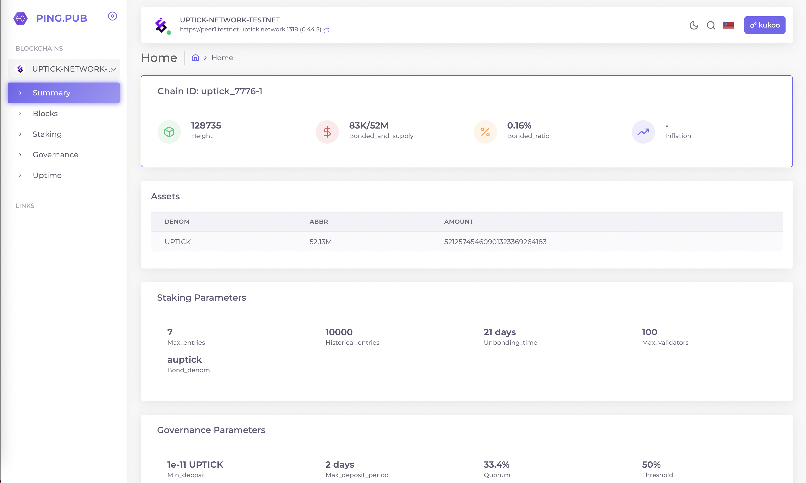
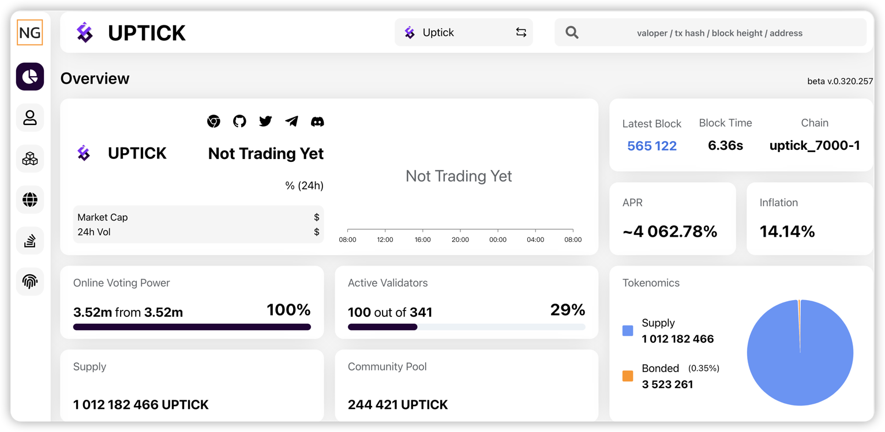

<!--
order: 1
-->

# Block Explorers

Read about the different types of block explorers on Uptick. {synopsis}

## Introduction

Blockchain explorers allow users to query the blockchain for data. Explorers are often compared to search engines for the blockchain. By using an explorer, users can search and track balances, transactions, contracts, and other broadcasted data to the blockchain.

Uptick offers two types block explorers: an EVM explorer and a Cosmos explorer. Each explorer queries data respective to their environment with the EVM explorers querying Ethereum-formatted data (blocks, transactions, accounts, smart contracts etc) and the Cosmos explorers querying Cosmos-formatted data (Cosmoss and IBC transactions, blocks, accounts, module data, etc).

## EVM-based

### Uptick EVM Explorer (Blockscout)

The [Uptick EVM explorer](https://evm-explorer.testnet.uptick.network/) is the EVM explorer for Uptick. The EVM explorer allows users to view Uptick EVM activity such as smart contract creations, interactions, token transfers, and other types of transactions. Users can also view Uptick and ERC-20 token balances through the Uptick EVM Explorer

## Cosmos-based

### Uptick Cosmos-based Explorer (Ping-hub)

### Uptick Cosmos-based Explorer (GN)

The [Uptick Cosmos-based Explorer (Ping-hub)](https://explorer.testnet.uptick.network/) and [Uptick Cosmos-based Explorer (GN)](https://uptick.explorers.guru/) is the Cosmos explorer for Uptick. The Cosmos-based explorer allows users to view Uptick activity within the Cosmos ecosystem. This explorer allows users to query transactions, delegations, IBC token transfers, and other Cosmos-related Uptick activity. Users can also view tokeneconomics and governance data using the Uptick Cosmos-based explorer.
